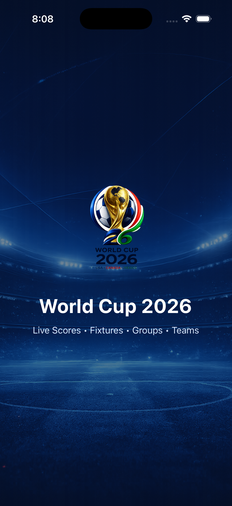
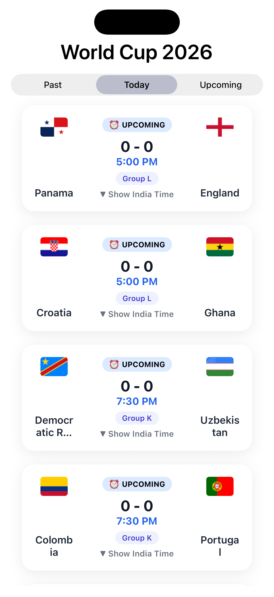

# ⚽ World Cup 2026 - Matches

A React Native application built with **Expo** and **TypeScript** that displays FIFA World Cup 2026 match fixtures and results using the World Cup 2026 API.

---

## App Preview

<table>
  <tr>
    <td align="center">
      <b>Splash Screen</b><br><br>
      
    </td>
    <td align="center">
      <b>Home Screen</b><br><br>
      
    </td>
  </tr>
</table>

## Features

- 📅 View matches categorized as:
  - Past
  - Today
  - Upcoming
- 🏆 Match score display
- ⚽ Home and away teams with country flags
- 🕒 Kickoff time
- 🇮🇳 Indian kickoff time (expand card)
- 📆 Match date (Past & Upcoming)
- 🏟 Group information
- 📱 Expandable match cards
- 🔄 Pull data from the live World Cup 2026 API
- ⚠️ Loading and error states
- 🎨 Custom splash screen

---

## Tech Stack

- React Native
- Expo SDK 54
- TypeScript
- Zustand
- React Native Safe Area Context
- React Native Segmented Control

---

## Project Structure

```
src
├── components
│   ├── MatchCard.tsx
│   └── MatchList.tsx
│
├── lib
│   ├── match_utils.ts
│   └── world_cup_2026_api.ts
│
├── screens
│   ├── HomeScreen.tsx
│   └── SplashScreen.tsx
│
├── store
│   └── use_matches_store.ts
│
├── types
│   └── match.ts
│
└── App.tsx
```

---

## Installation

Clone the repository

```bash
git clone https://github.com/dainyjose/world_cup_2026.git
```

Install dependencies

```bash
npm install
```

Start the development server

```bash
npx expo start
```

Run on Android

```bash
npx expo run:android
```

Run on iOS

```bash
npx expo run:ios
```

---

## API

Base URL

```
https://worldcup26.ir
```

Endpoints used

```
GET /get/games
GET /get/teams
GET /get/stadiums
```

API Documentation

https://worldcup26.ir/api-docs/

---

## Match Card

Each match card displays:

- Home team
- Away team
- Team flags
- Score
- Match date (Past & Upcoming)
- Kickoff time
- Group
- Indian kickoff time (tap to expand)

---

## Current Functionality

- Fetch matches from the API
- Fetch team information
- Fetch stadium information
- Combine match and team data
- Categorize matches into:
  - Past
  - Today
  - Upcoming
- Sort matches by kickoff time
- Display loading and error states

---

## Future Improvements

- Live match updates
- Match details screen
- Stadium details
- Team details
- Search matches
- Favorite matches
- Match notifications

---

## Author

**Dainy Jose**

React Native Developer
